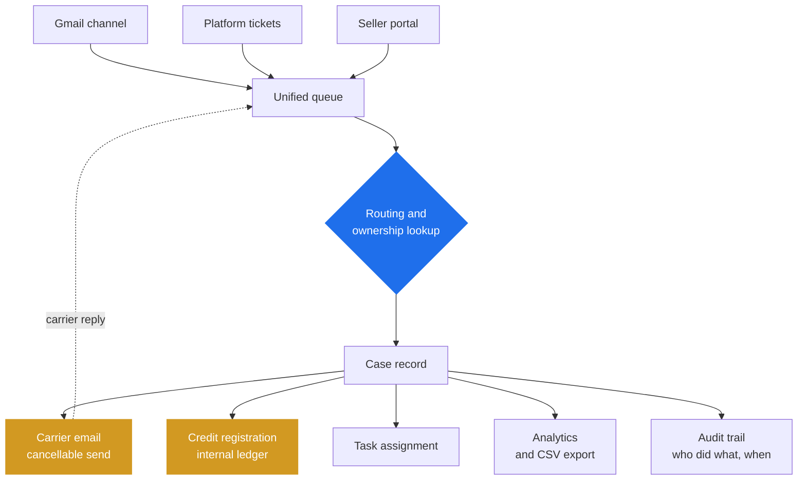
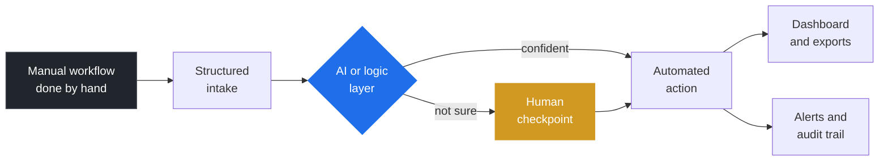

# Harshil Lakhani

### Full-Stack Developer & Business Process Automation Engineer building custom software, internal tools and AI-powered systems.

I build full-stack software and business process automation systems for companies with manual or disconnected operations.

 

## What I have built

These are client projects, so the code is private. Here is what they do.

 

### 🏭 3PL Operations Platform

A complete internal platform for a fulfilment company. It brings seller operations, carrier
investigations, customer support, warehouse attendance, credits and analytics into one place.
Before it existed, the team worked out of a shared mailbox, a pile of spreadsheets and a
whiteboard on the warehouse wall.

**16 product pages, 97 backend routes, 5 workspaces, role aware access.**

| Workspace | What it does |
|:--|:--|
| Global order search | Searches the fulfilment API centrally, so an operator does not need to know which seller owns an order before they start. Takes platform, remote, sequential or tracking references, and shows seller names instead of numeric codes. |
| Queries and investigations | Guided intake, evidence upload, and a full case timeline. Unknown queries get their own queue. |
| Support workspace | Folders, ticket list and the live conversation all on one screen. Platform tickets and Gmail arrive in the same inbox. You can search by email, order, tracking, invoice or ticket number. |
| Credits | Register a shipment or seller credit straight from a ticket. The order lookup confirms who owns it, then writes an internal financial record. Includes an undo. |
| Warehouse and workforce | Employee directory with live task and status, clock in and out, break tracking, and full shift history that admins can correct. |
| Analytics | Investigations measured separately from support: open workload, backlog, created against completed, status breakdown, who closed what, and CSV export. |

A few decisions worth explaining. The client's fulfilment platform stays read only: credits write
to an internal record and never change anything on their live account. Anything that moves money
or changes state can be undone, and carrier emails go out through a send window you can still
cancel. Analytics runs on Amsterdam day boundaries, because a working day for this client is a
Dutch day and not UTC. Get that wrong and every daily number is quietly incorrect.

 

### 📮 3PL Email Automation and Investigation Portal

Built for a logistics operator in the Netherlands. When a parcel went missing or turned up damaged,
someone had to collect the order details, work out which carrier to contact, write the email,
attach the evidence, and then chase the reply somewhere else. About **90% of that manual email work
is now gone**, and the system runs in daily operations.

The portal lists shipped orders that can still be investigated, then walks the seller through a two
step form. Validation rules change depending on the carrier, since they each ask for different
things. Evidence files get uploaded in the same flow. The system writes the carrier email, sends it
to the right address, and pulls carrier replies back into the same case thread instead of into
someone's inbox. The interface is in Dutch, because the operations team is Dutch.

 

### 📺 Warehouse Operations Dashboard

Made for a screen on the warehouse wall rather than a desk. It shows who is working in which zone
right now (pick and pack, replenishment, inbound, containers, returns), which tasks are open, and
which ones are urgent. It refreshes every 10 seconds, so a supervisor can spot a bottleneck without
walking over to ask.

It also produces 9 different CSV and Excel exports for managers, including a multi sheet workbook
with daily trends and a summary for each department.

 

### 💬 AI Support Chat with Live Human Handoff

Most support bots say "I don't know" and the customer gives up. This one answers only from the
company's own documents, checks how confident it is, and when it is not sure, it pulls a human
agent into the same chat. The customer never has to start again or repeat themselves.

There are three parts: a chat widget you drop into any website, a backend that does the retrieval,
and a live agent dashboard. Questions the bot could not answer go into their own queue, so the team
can see exactly where their documentation is thin.

 

### 🏗️ AI Property Feasibility Platform

This one turns zoning PDFs into costed feasibility reports. It reads the documents and pulls out
the constraints: plot area, setbacks, coverage limits, site conditions. Every value it extracts
comes with the sentence it was taken from and a confidence score, and a person has to approve or
reject it before it goes anywhere near the cost calculation.

Approved constraints then feed into scored design concepts and a cost estimate that lists what it
does not know, rather than hiding the gaps.

 

### Also shipped

| Project | What it does |
|:--|:--|
| SEO content platform | Replaced a content team copying and pasting across six brand websites. It generates content using live search data, sends it through human review, publishes structured JSON to GitHub, and translates into 12 languages. All from one screen. |
| Website generation system | Generates complete niche websites, each with its own brand identity and multi section pages. Over 50 built, and each one deploys in under two minutes. |
| AI media platform | Ten separate tools brought into one Python backend: image, video, caption, transcript, file conversion and document generation. Jobs run in the background with live progress. |
| Link analytics SaaS | Trackable links with traffic reporting. Clicks by platform, device, country and city, engagement trends, and period comparison. Built on BigQuery. |

 

## How I usually build things

Most of my projects follow the same path.

The yellow step is the one most people skip. Confidence checks, review steps, undo buttons, and a
record of who did what. In a real business a wrong answer delivered confidently costs more than a
slow one, so I build systems that stop and ask instead of guessing.

**Automate the routine. Clarify the exception. Keep the human in control.**

 

## What I work with

| | |
|:--|:--|
| **Languages** | TypeScript, JavaScript, Python, Dart |
| **Frontend** | Next.js, React, Tailwind, Flutter |
| **Backend** | Node.js, Express, Fastify, FastAPI |
| **Databases** | PostgreSQL, MongoDB, Redis, Firestore, Supabase, BigQuery |
| **AI** | OpenAI, Anthropic, Gemini, Vertex AI, LangChain, LangGraph, RAG |
| **Automation** | n8n, Puppeteer, Playwright, BullMQ, Pub/Sub, WebSockets |
| **Infrastructure** | Google Cloud, AWS, Docker, Cloudflare, Vercel, Firebase, GitHub Actions |

 

## Public repos

| Repo | What it is |
|:--|:--|
| [openclaw-whatsapp-ticket-bot](https://github.com/harshilLakhani22/openclaw-whatsapp-ticket-bot) | Watches WhatsApp groups for ticket listings, saves them to Firestore, and answers questions about them in plain English. Built with Baileys, Gemini and TypeScript. |
| [Marketing-Agent](https://github.com/harshilLakhani22/Marketing-Agent) | Agent driven marketing workflows in Python. |

 

**Open to freelance and contract work.**

Surat, India. I work across European and US hours.
English, Hindi, Gujarati.

